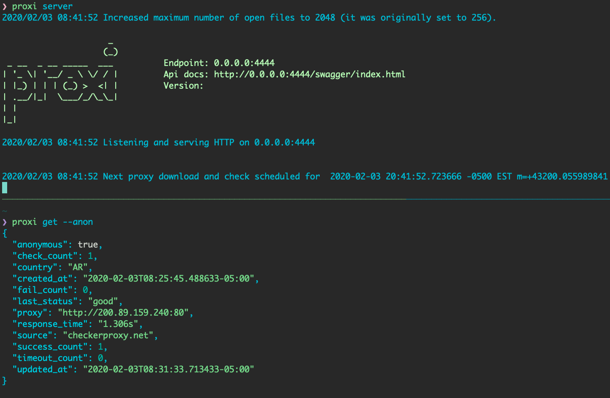

proxi
===
Proxi runs scheduled jobs for finding and checking proxies with a rest api for querying results.
It can find and check over 25k proxies in under 5 minutes.


## Download options

### Homebrew

Homebrew or Linuxbrew
```shell script
brew install nicksherron/proxi/proxi
```
### Go
Go version 1.11 or higher is required to go get proxi since it uses go modules.   
```shell script
GO111MODULE=on go get -u github.com/nicksherron/proxi
```

### Releases
Binaries for Windows, Linux and Darwin can be found under [releases](https://github.com/nicksherron/proxi/releases). If your os/architecture is not supported, submit an issue and more than likely it can be included.


## Usage 
More documentation is to come but the commands are pretty straight forward and all have help info with default options shown. 

```shell script
proxi server --init
```  
Will  start the server  and begin downloading/checking proxies. If you use the default listen address, 
you can go to http://localhost:4444/swagger/index.html in your browser to view the swagger api docs.


To get a proxy from the server just run
```shell script
proxi get 
```
or 
```shell script
curl localhost:4444/get
```





```shell script
$ proxi -h

Usage:
  proxi [command]

Available Commands:
  delete      Delete a proxy from the db.
  find        Find the record for a proxy
  get         Return one or more proxies from db that passed checks.
  help        Help about any command
  refresh     Re-download and check proxies.
  server      Download then check proxies and start rest api server for querying results.
  stats       Check server stats
  version     Print the version number and build info

Flags:
  -h, --help   help for proxi

Use "proxi [command] --help" for more information about a command.
```

### Contributing
Pull request welcome !